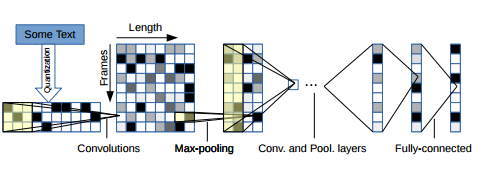

### Charecter Convolution Neural network

기존의 Text-CNN 의 경우 단어 단위의 임베딩 방법을 사용하였습니다. 하지만 Char-CNN 의 경우 단어 단위의 임베딩 학습이 아닌 Charecter 단위의 학습으로 이루어져 있습니다. 구현한 Char-CNN 의 경우 가장 처음으로 시도되었던 방식의 논문을 이용하였고 모든 파라메터와 구현방식이 동일하지는 않습니다.

### Paper implement 

[Original paper][1] : Charecter-level Convolutional Networks for Text Classification.

본 논문의 저자는 Character 단위의 Text classification 은 몇가지 장점을 가진다고 주장합니다.  
1. 데이터셋의 크기가 충분히 클 경우, deep ConvNet 은 단어들의 인식을 필요로 하지 않는다. 즉 Text의 의미론적, 통사론적 구조가 학습의 중요한 요소가 아니다.
2. Text Classification 의 경우 전처리가 중요한 요소로 작용할 수 있는데 이 Char 단위일 경우 문법적 오류나 스펠링의 오류에 이점이 있다고 주장합니다. 

### Dataset 

dataset : TREC-QA  
Test Accuracy : 82.031 %  

### Model architecture

