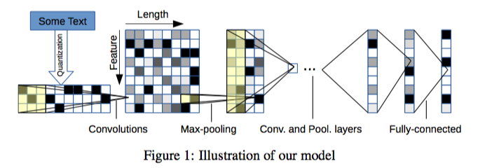

## Character-level Convolutional Networks for Text Classification

### Overview
- url: https://arxiv.org/abs/1509.01626

### Highlights
- Character를 하나의 신호로 생각하여 Convolutional Network을 적용 -> Text Classification의 문제를 해결
  - 장점 여러 언어를 한번에 쓰는 경우에 장점을 가짐
  - 맞춤법 오류나 이모티콘과 같은 비정상적인 문자 조합이 자연스럽게 학습 될 수 있음

### Summary
- 기존 Character based연구들은 Part-of-speech tagging이나 information retrieval에 활용됨
-
### Network의 구성법
#### Character One-Hot Encoding
- 인코딩은 입력 언어에 대해 크기 m의 알파벳을 지정하고 1-of-m 인코딩 (또는 "one-hot"인코딩)을 사용
- 그 다음, 문자들의 시퀀스는 고정 된 길이 $l_0$가 m 개의 크기가 매겨진 벡터들의 연속으로 변환함
- 길이가 $l_0$를 초과하는 단어는 무시
- 공백 문자를 포함하여 알파벳에 없는 문자는 모두 제로 벡터로 변환됨
- 문자의 벡터화는 역순 역순이므로 문자의 최신 읽기가 항상 출력의 시작 부분에 배치되므로 완전히 연결된 레이어가 가중치를 최신 읽기와 쉽게 연관시킬 수 있습니다. -> 이 부분은 코드를 보고 이해할 필요가 있음
#### Network 구축
- 2 개의 ConvNets를 설계, 하나는 크고 하나는 작음
- 그것들은 6 개의 컨볼루션 레이어와 3개의 Fully Connected를 가진 9 개의 레이어

- Input은 70개의 Feature를 가짐 <- 위의 Character One-Hot Encoding으로 인해
- Input Feature의 길이는 1014개 이다.
- 2개의 Dropout이 후반부 Fully Connected Networkds에 regularize를 위해 사용되었다.
  - Dropout probability는 0.5로 설정
- ConvNet과 Fully Connected Layer의 상세 설정은 논문을 참고할 것
- Gaussian distribution으로 Weights를 초기화함
  - Large Model: mean - 0, std - 0.02
  - Small Model: mean - 0, std - 0.05
- 마지막 convnet layer의 크기는 $l_6 = \frac{(l_0 - 96)}{27}$ -> 여기서 96이랑 27은 왜인지 모르겠음
#### Data augumentations
- 본 논문에서는 데이터 증가를 위해 English thesaurus를 사용함

### Experiments
#### 비교대상 방법들
- Bag-of-words and its TFIDF
- Bag-of-ngrams and its TFIDF
- Bag-of-means on word embedding - word2vec의 결과를 가지고 평균을 낸 후 k-means clustering을 실시한 방법
- LSTM을 활용한 문서 분류
#### 실험 결과
- 좀 정형화된 데이터 셋들에서는 ngrams TFIDF가 가장 높은 성능을 나타냈고
- 비정형화된 데이터 셋(리뷰나 사람들이 웹상에 쓰는 글들)에서는 char-cnn이 좋은 결과를 내는 것으로 보인다.
  - 유저가 만든 데이터가 더 잘 된다
- 저자는 이걸 데이터 크기 문제라고 설명했다. 데이터 크기가 백만이 넘어갈경우 전체적으로 분류결과가 더 좋았다
- 알파벳의 경우, 대소문자중 어느 것을 선택해야할지 모르겠다
-
